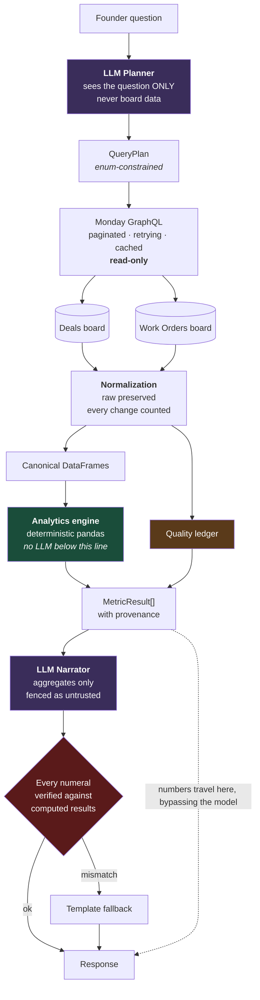

# Skylark Business Intelligence

A conversational business intelligence agent over Monday.com. Ask a founder-level question in plain English; get an executive answer with the numbers, the reasoning, and an honest account of what the data could not tell you.

> Most BI chatbots will confidently give you a wrong number.
> This one tells you which records it couldn't use, and why.

**Live demo: https://skylark-monday-bi-agent-tply.onrender.com**

*(Free-tier hosting sleeps after ~15 minutes idle — the first request may take 30-50s to wake. Subsequent ones are 2-5s.)*

---

## What it does

- Connects **dynamically and read-only** to two Monday.com boards (Deals, Work Orders)
- **Normalizes messy real-world data** — inconsistent statuses, mixed date formats, missing amounts, header rows embedded as data
- Answers questions across **sales, delivery, and both boards combined**
- Computes every figure **deterministically in Python** — the language model never does arithmetic
- Reports a **data-quality ledger** with every answer: records used, records excluded, why, and a confidence level
- **Refuses to invent** — no sector that doesn't exist, no join the data can't support, no zero standing in for "unknown"

## Architecture



The two purple boxes are the only non-deterministic components. Everything else is plain Python that produces the same answer every time.

**The load-bearing decision:** metric values travel to the UI straight from the analytics engine, bypassing the model. A hallucinating narrator can only produce worse *wording* — never a wrong *number*. And after generation, every numeral in the prose is verified against the computed results; a mismatch discards the narration and renders from a template instead.

## Features

**Sales** — open pipeline, weighted pipeline, won revenue, win rate, median and average deal size, funnel by stage, pipeline by sector and owner, stale deals, concentration risk, pipeline ageing

**Delivery** — work order counts by status, completion rate, delayed work with delay detail, project duration, overdue backlog value, billing gap, completed-but-unbilled

**Cross-board** — sector opportunity vs execution matrix, accounts with both open pipeline and delivery risk, deals won vs work delivered, owner sales vs delivery

**Movement** — quarter-over-quarter new pipeline, with automatic fallback to the most recent quarters that contain records

**Executive** — CEO summary, **leadership briefing** (snapshot, quarter-on-quarter movement, ranked risks with figures attached, and copy-paste-ready talking points), data-quality report

**Reliability** — per-query confidence scoring, query-plan transparency, stated assumptions, keyword-routing fallback if the LLM is down, template narration if it fails mid-answer, stale-cache serving if Monday is unreachable

## Tech stack

| Layer | Choice | Why |
|---|---|---|
| Backend | Python 3.11 · FastAPI · pandas | The heaviest work is data normalization |
| LLM | Groq / Anthropic / Ollama, provider-abstracted | Free tier for demo, paid fallback, local for offline dev |
| Agent | Hand-rolled, no framework | One structured call — a framework would be pure overhead |
| Monday | GraphQL API v2, direct | Full control over pagination, retry and read-only enforcement |
| Frontend | Vanilla JS + CSS, served by FastAPI | One deployment, no CORS, no build step |
| Tests | pytest — **290 tests**, incl. a golden-question eval suite | Concentrated on normalization and metrics, where bugs live |

---

## Setup

### 1. Prepare the data

```bash
python scripts/prepare_for_monday.py
```

Writes `data_clean/deals_clean.csv` and `data_clean/work_orders_clean.csv`. This fixes only *structural* problems (the header on row 2, header rows embedded as data, four empty columns). All other messiness is left in deliberately — the agent handles it at query time.

### 2. Create the Monday.com boards

Create two boards by importing the CSVs (**+ Add → Import data → Excel/CSV**).

**Board 1 — name it exactly `Deals`**

| Column | Type |
|---|---|
| Deal Name | Item name |
| Owner code, Deal Status, Deal Stage, Closure Probability | Status |
| Client Code | Text |
| Sector/service, Product deal | Dropdown |
| Masked Deal value | **Numbers** |
| Tentative Close Date, Close Date (A), Created Date | **Date** |

**Board 2 — name it exactly `Work Orders`**

| Column | Type |
|---|---|
| Deal name masked | Item name |
| Serial #, Customer Name Code, Type of Work | Text |
| Sector, Nature of Work, Document Type | Dropdown |
| Execution Status, BD/KAM Personnel code, Invoice Status, WO Status (billed) | Status |
| Probable Start/End Date, Data Delivery Date, Date of PO/LOI | **Date** |
| Amount (Excl/Incl GST), Billed Value, Amount Receivable | **Numbers** |

> **Important:** `Masked Deal value` must import as **Numbers**. If it lands as Text, blank cells can become `0`, which would destroy the missing-value analysis the whole system rests on.
>
> Board names matter — boards are resolved by name, not hardcoded ID. Column *titles* can drift; an alias table absorbs renames.

### 3. Get an API token

Avatar (bottom-left) → **Administration → Connections → API** → copy the personal API token.
*(On some plans: avatar → Developers → My Access Tokens.)*

### 4. Configure

```bash
cp .env.example .env
```

| Variable | Required | Notes |
|---|---|---|
| `MONDAY_API_TOKEN` | **yes** | Read-only usage; never leaves the server |
| `MONDAY_DEALS_BOARD_NAME` | | Default `Deals` |
| `MONDAY_WORK_ORDERS_BOARD_NAME` | | Default `Work Orders` |
| `MONDAY_DEALS_BOARD_ID` / `..._WORK_ORDERS_BOARD_ID` | | Optional: pin IDs instead of resolving by name |
| `LLM_PROVIDER` | | `groq` (default) · `anthropic` · `ollama` |
| `GROQ_API_KEY` | for groq | Free at console.groq.com, no card |
| `ANTHROPIC_API_KEY` | for anthropic | |
| `FISCAL_YEAR_START_MONTH` | | Default `4` (April–March). Set `1` for calendar quarters |
| `DATA_SOURCE` | | `monday` (default) · `local_csv` for offline development |

Without an LLM key the system still works — it falls back to keyword routing and template answers, with identical numbers.

### 5. Run

```bash
pip install -r backend/requirements.txt
cd backend && uvicorn app.main:app --reload --port 8000
```

Open **http://localhost:8000**

Or with Docker:

```bash
docker compose up --build
```

## Testing

```bash
cd backend && python -m pytest -q               # 290 tests
cd backend && python -m pytest -m eval -q       # golden-question suite only
cd backend && python -m pytest -m "not eval" -q # everything else
```

Coverage concentrates where correctness actually lives:
- **Normalizers (85)** — every date format, currency format, status/sector/stage alias, and the guarantee that a missing amount is `None` and never `0`
- **Metrics (22)** — known-answer fixtures; win rate with zero closed deals returns `None`, not a `ZeroDivisionError`; the account join doesn't multiply rows
- **Agent (69)** — intent routing, plan validation against unknown values, the number-verification guard, prompt-injection fencing, and an assertion that **no GraphQL mutation exists anywhere in the codebase**
- **Golden-question eval (92)** — runs the real pipeline over the actual spreadsheets and pins metric values for 16 founder questions. It asserts *intent and arithmetic*, never prose. Two invariants apply to every question: any metric excluding rows must say why, and no rupee metric may report `0` with no contributing rows

Both suites run in CI on every push.

See **[DEMO.md](DEMO.md)** for a full walkthrough script.

## Example queries

1. *What's our total pipeline?* — the ledger appears in the first answer
2. *How's our pipeline looking for the energy sector this quarter?* — **there is no Energy sector**; the agent says so and names the real ones instead of inventing data
3. *Which sectors have the strongest pipeline?*
4. *How many work orders are delayed?*
5. *Which sectors have the strongest pipeline but weak execution?* — the cross-board matrix
6. *Which accounts have both open pipeline and delivery risk?*
7. *What's our won revenue?* — answers, then flags that 61% of won deals have no value recorded
8. *What data quality problems do we have?*
9. *Give me a CEO-level summary of the business.*
10. *Prepare this week's leadership update.* — briefing mode, with a copy button

## Security

- **Read-only by construction** — no `mutation` string exists in the codebase; a test enforces it
- Secrets are server-side only and never reach the browser
- **Prompt injection is answered architecturally**: the planner never sees board data, so the main attack surface doesn't exist. The narrator receives only aggregates, fenced as untrusted, and numbers bypass it entirely. Board text is additionally screened for instruction-shaped content and surfaced as a data-quality warning
- All board-derived strings are rendered as text nodes, never as HTML
- Errors are structured; stack traces and configuration never reach the client

## Deployment

**Render** (free tier):
- New Web Service → connect this repo
- Build: `pip install -r backend/requirements.txt`
- Start: `cd backend && uvicorn app.main:app --host 0.0.0.0 --port $PORT`
- Add `MONDAY_API_TOKEN` and `GROQ_API_KEY` as environment variables

`render.yaml` is included for one-click deployment.

> Free tiers sleep after ~15 minutes idle and take 30–50s to wake. **Load the URL a few minutes before demoing.**

## Known limitations

Documented in full in [DECISION_LOG.md](DECISION_LOG.md). The material ones:

- **Customer-level cross-board analysis is impossible.** The two boards mask customers in non-overlapping namespaces (`COMPANY089` vs `WOCOMPANY_002`). The agent refuses this and explains why rather than fuzzy-matching a relationship into existence.
- **No receivables or collections metrics** — four source columns are 100% empty.
- **Won revenue is understated** — 61% of won deals carry no value. Reported every time it's asked.
- Deal name links accounts, not individual deals — it isn't unique on the Deals board, so cross-board joins are aggregated to account level first.
- No auth or persistence; conversation memory is the last two turns.
